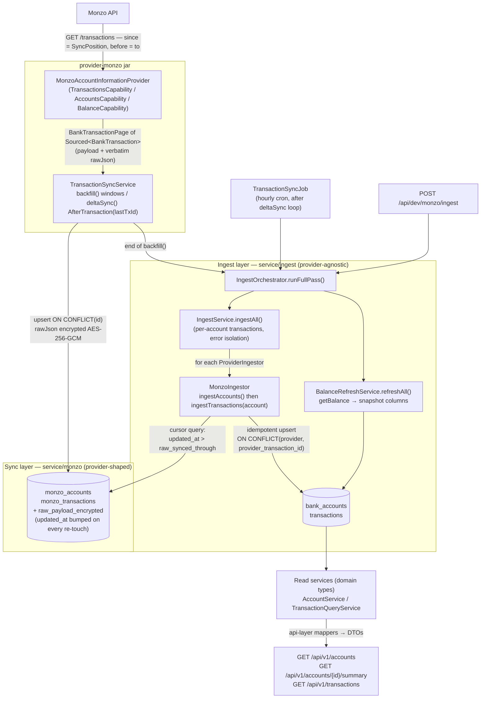

# The Ingest Pipeline — how money data flows through Budgeteer

> How a transaction travels from Monzo's API to `GET /api/v1/transactions`: every layer it
> crosses, which class owns each hop, and the invariants that keep the pipeline honest.
> Class names and tables are the real ones — grep them.

## The two-layer model

Budgeteer deliberately stores money data twice:

| Layer | Tables | Shape | Owner |
|-------|--------|-------|-------|
| **Raw** (landing zone) | `monzo_accounts`, `monzo_transactions` | Provider-shaped: Monzo ids as PKs, Monzo's field semantics, encrypted verbatim JSON | Sync layer (`service/monzo`) |
| **Domain** (product) | `bank_accounts`, `transactions` | Provider-agnostic: UUID PKs, normalised enums, user-owned columns | Ingest layer (`service/ingest`) |

The raw layer exists so provider quirks never leak upward, re-syncs are cheap, and the
verbatim payload survives for future field backfills. The domain layer is what every product
feature reads. **The ingest pipeline is the one-way bridge between them.**

## End-to-end flow



## Stage by stage

### 1. Provider fetch (`provider-monzo`)

`MonzoAccountInformationProvider.getTransactions(accessToken, accountId, position, to)` takes a
sealed **`SyncPosition`** — `FromTime` (window start), `AfterTransaction` (id-based delta), or
`NextPage` (opaque page cursor) — all of which map onto Monzo's `since` query param. Every
mapped element comes back as **`Sourced<BankTransaction>`**: the pure domain value plus the
verbatim provider JSON, kept separate so raw payloads never enter `equals`/`hashCode` or logs.

### 2. Sync into raw (`TransactionSyncService`)

Two write paths, both ending in the native `monzo_transactions` upsert (`ON CONFLICT (id)`):

- **`backfill(connectionId)`** — walks ≤350-day windows back to the account floor, each window
  committed in its own transaction (progress survives SCA pauses / restarts).
- **`deltaSync(accountId)`** — hourly; opens with `AfterTransaction(lastTransactionId)`, or
  `FromTime(floor)` on a first run.

At the persistence edge the `Sourced` envelope is unwrapped: `sourced.rawJson()` is encrypted
(AES-256-GCM via `EncryptionService`, NULL when the provider gave none) into
`raw_payload_encrypted`. Crucially, **every upsert bumps `updated_at`** — including re-touches
of existing rows (settlement arriving, notes changing). That bump is what drives the ingest
cursor.

### 3. Trigger (`IngestOrchestrator.runFullPass()`)

One entry point owns the "ingest, then refresh balances" pairing and its error isolation
(an ingest failure never blocks the balance refresh). Three callers:

| Trigger | When |
|---------|------|
| `TransactionSyncJob` | Hourly, after the deltaSync loop |
| `TransactionSyncService.backfill()` | End of every backfill — incl. the NEEDS_REAUTH pause path, so partial data still surfaces on first connect |
| `DevMonzoController POST /api/dev/monzo/ingest` | Manual dev re-run |

### 4. Raw → domain mapping (`IngestService` → `MonzoIngestor`)

`IngestService.ingestAll()` iterates every registered `ProviderIngestor` (Spring injects all
implementations — TrueLayer would simply add one). Per provider:

1. **`ingestAccounts()`** — one transaction. Reads ALL raw accounts (closed ones included);
   upserts domain `bank_accounts` keyed `(provider, provider_account_id)` — a stable identity
   that survives disconnect/reconnect. Lifecycle mirroring: raw `closed` OR inactive
   connection ⇒ `archive()`; reappearing open ⇒ `unarchive()`. `account_type` is normalised
   (`uk_retail`→CURRENT, `uk_monzo_flex`→CREDIT_CARD, unknown→OTHER + WARN).
2. **`ingestTransactions(account)`** — one transaction per account (isolation: one account's
   failure never loses another's progress). The **cursor query** fetches raw rows with
   `updated_at > bank_accounts.raw_synced_through`, so it picks up new rows AND re-touched
   ones (settlement flips) in a single mechanism. Each row goes through the domain upsert
   keyed `(provider, provider_transaction_id)`; the cursor then advances to the **max
   processed raw `updated_at`** — never `now()`, so a row written mid-run can't be skipped.

### 5. Balance snapshots (`BalanceRefreshService`)

Balances are **stored provider snapshots**, never derived from transactions (windowed history
+ pending + credit-card semantics make derivation wrong). Per syncable raw account:
`getBalance` → `bank_accounts.balance_minor_units` + `balance_as_of`. Revoked connection ⇒
abandon that connection's remaining accounts; any other failure ⇒ skip that account, continue.

### 6. Read path

`AccountService` / `TransactionQueryService` speak domain types only; controller-adjacent
mappers (`AccountApiMapper`, `TransactionApiMapper`) produce the v1 DTOs. Queries are
user-scoped in JPQL — user A can never see user B's rows regardless of what the controller
passes down.

## Invariants (the rules that keep it honest)

| # | Invariant | Enforced by |
|---|-----------|-------------|
| 1 | Ingest is **idempotent** — re-running maps everything again with zero duplicates | Domain upsert `ON CONFLICT (provider, provider_transaction_id)` |
| 2 | **User-owned columns are never overwritten** (`notes`, `excluded_from_analytics`) | Deliberately omitted from the upsert's UPDATE set |
| 3 | **Declined transactions are never mapped** — but still advance the cursor | Explicit skip in `MonzoIngestor.ingestTransactions` |
| 4 | Settlement flips propagate without a special path | Raw re-touch bumps `updated_at` → cursor re-selects the row → upsert flips `status`/`settled_at` |
| 5 | Cursor never skips concurrent writes | Advances to max *processed* `updated_at`, never `now()` |
| 6 | Accounts are archived, never deleted — reconnect revives the same UUID and history | Stable `(provider, provider_account_id)` key + `archive()`/`unarchive()` |
| 7 | Raw JSON is encrypted at rest and never logged | `EncryptionService` at the persistence edge; `Sourced.toString()` redacts |
| 8 | One account's failure never loses another's ingest | Per-account `TransactionTemplate` transactions in `IngestService` |

## Observability

A full pass logs (INFO):

```
Ingested 427 transactions [account=<uuid>, rawRows=427, cursor → 2026-09-07T21:10:53Z]
Ingest pass complete [provider=MONZO, accounts=1, transactionsMapped=427, failedAccounts=0]
Balance refresh complete [accountsRefreshed=1]
```

Zero raw rows past the cursor logs at DEBUG per account — a silent INFO gap between
"Backfill finished" and "Balance refresh complete" should no longer exist; if it does,
something is wrong.

## Known trade-offs (recorded, deliberate)

- **Throughput:** each domain row is one upsert round-trip (~100 rows/s observed). Fine at
  personal scale on an hourly cadence; batch the upserts if it ever matters.
- **Settled-flip blind spot:** a settlement Monzo never re-sends (older than the raw delta
  window) won't reach raw, so it can't reach domain — accepted until webhooks (#5).
- **Monzo-shaped sync layer:** `service/monzo` (job/service/listener) generalises to the
  `ProviderIngestor`-style orchestrator-plus-strategy pattern when TrueLayer lands — tracked
  on the TrueLayer board row.

## Debugging quick-reference

```sql
-- Force a full re-map (idempotent — proves invariant 1):
update bank_accounts set raw_synced_through = null;
-- then: POST /api/dev/monzo/ingest

-- Simulate a settlement flip (proves invariant 4):
update monzo_transactions set monzo_settled_at = now(), updated_at = now() where id = 'tx_...';
```

Breakpoints that show the whole story: `IngestOrchestrator.runFullPass`,
`IngestService.ingestAll`, `MonzoIngestor.ingestTransactions`, `TransactionRepository.upsert`.
